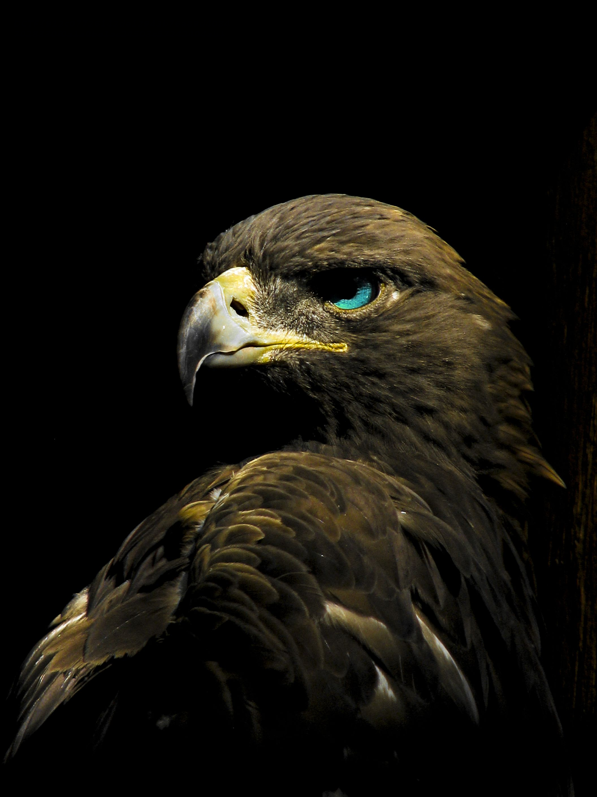
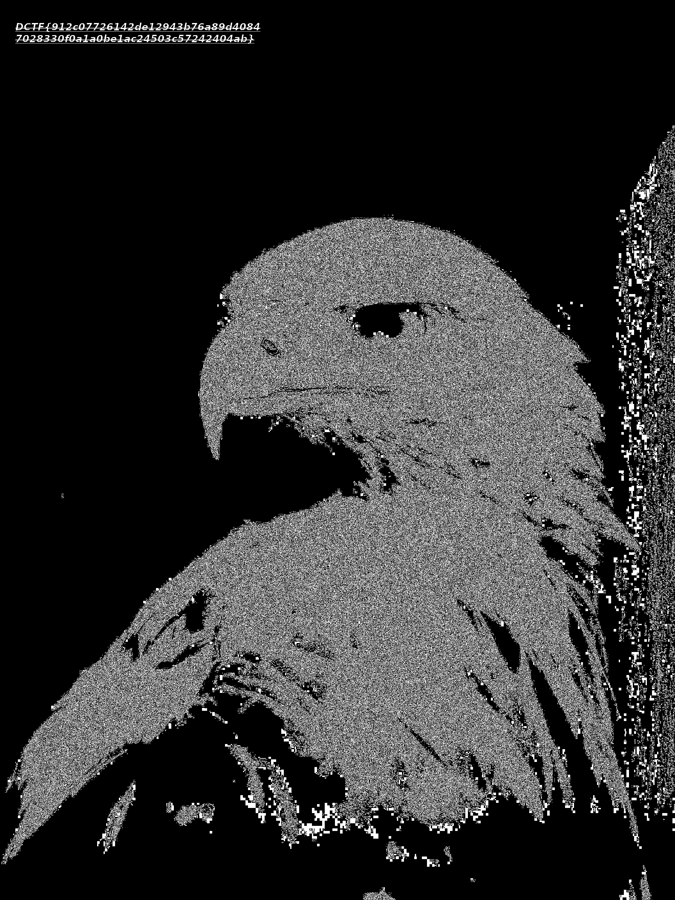

# EagleEye
### (Junior - 1pts)
> Do you see it?

------
As we are given a png image then it would most probably be a steganography challenge

Thus, I ran it with my stego goto [tool](https://github.com/bannsec/stegoVeritas)

In it auto-analysis mode's output of blue colormap  we see our flag in top left corner

------
Flag: DCTF{912c07726142de12943b76a89d40847028330f0a1a0be1ac24503c57242404ab}
